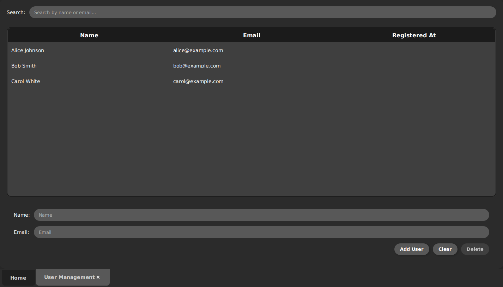
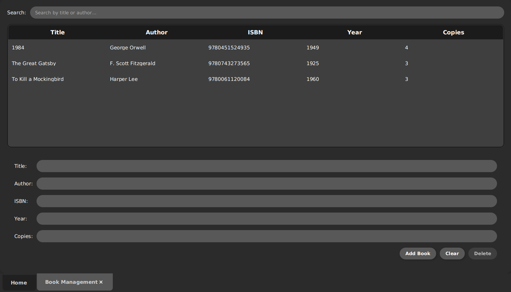
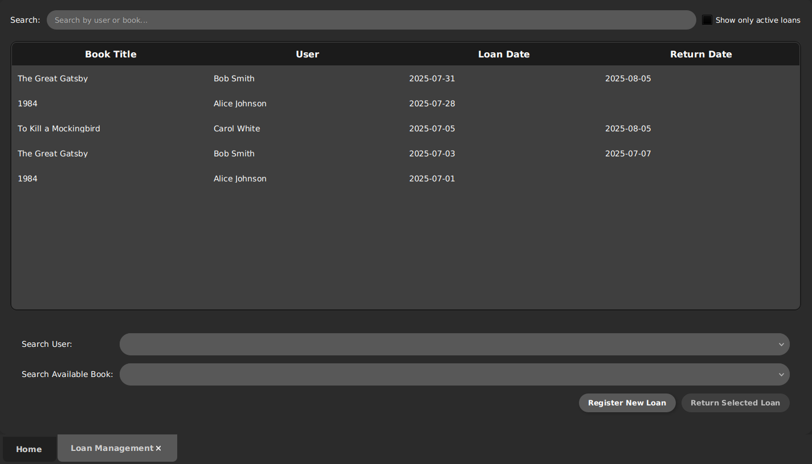
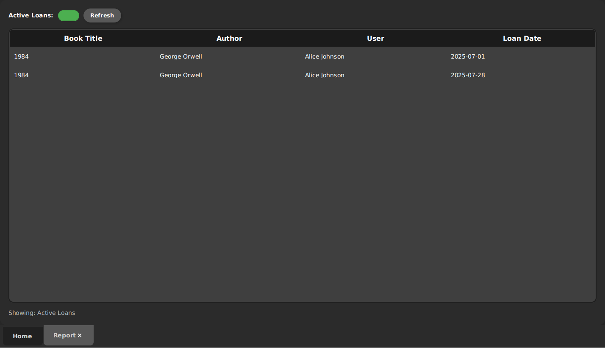

# Caio's Library - Library Management System

A simple, plugin-based Library Management System developed as a project for the Object-Oriented Programming course (INF008) at IFBA. The application is built with Java 24, JavaFX for the user interface, and Maven as the build tool. It uses a microkernel architecture where each core functionality is an independent, dynamically loaded plugin.

---

## Features

* **User Management:** Add, update, delete, and list library users.

* **Book Management:** Add, update, delete, and list books in the collection.

* **Loan Management:** Register new loans and process returns.

* **Reporting:** View a report of all currently active loans.

* **Dynamic Plugin Architecture:** All features are modular and can be added or removed by simply adding or removing their respective JAR files.
* **Custom Dark Theme:** A cohesive and modern dark theme applied across the entire application and all plugins.

---

## Prerequisites

Before you begin, ensure you have the following software installed on your system:

* **Git:** To clone the repository.
* **JDK 24:** The project is compiled and runs on Java 24.
* **Apache Maven:** To compile the project and manage dependencies.
* **Docker & Docker Compose:** To run the MariaDB database instance.

---

## Setup and Installation

Follow these steps to get the application running. All commands should be executed from your terminal.

### 1. Clone the Repository
First, clone this repository to your local machine:

```
git clone https://github.com/caioocardoso/java-plugin-library-system.git
cd java-plugin-library-system
```

### 2. Start the Database
The project uses a MariaDB database that runs in a Docker container. Navigate to the `docker-T2` directory and start the container in detached mode.

```
cd docker-T2
docker-compose up -d
```

This command will download the MariaDB image if you don't have it, create the container, and initialize the database with the schema and sample data from `init.sql`.

To access the database directly via a command-line client, you can use the following command:

```
mariadb -h 127.0.0.1 -P 3307 -u root -proot --skip-ssl bookstore
```

Navigate back to the project's root directory before proceeding to the next step:

```
cd ..
```

---

## Compilation and Execution

This project is configured to be compiled and run entirely from the command line, without needing any IDE.

### 1. Compile and Package the Application

Run the standard Maven `install` lifecycle goal from the root of the project. This command will:
* Clean any previous builds.
* Compile all modules (`app`, `interfaces`, `plugins`, etc.).
* Package everything into JAR files.
* Copy each plugin's JAR and its dependencies to the correct directory, making them available for the application to load at runtime.

```
mvn clean install
```

If the build is successful, you are ready to run the application.

### 2. Run the Application
Use the `exec-maven-plugin` configured in the `app` module to run the application:

```
mvn exec:java -pl app
```

The JavaFX application window for the Library Management System should now appear.

---

## Project Structure

The project is organized into several Maven modules:

* `/app`: The core application module. It contains the main class, the microkernel core logic, and the UI controller that builds the main window.
* `/interfaces`: Defines the contracts (`IPlugin`, `ICore`, etc.) that allow the core and the plugins to communicate without depending on each other's implementations.
* `/plugins`: A parent module that contains all the functional plugins.
    * `/plugins/userManagement`: Manages library users.
    * `/plugins/bookManagement`: Manages the book collection.
    * `/plugins/loanManagement`: Manages book loans and returns.
    * `/plugins/report`: Provides a report of active loans.

---

## Author

**Caio Oliveira Cardoso** - *Student at IFBA*